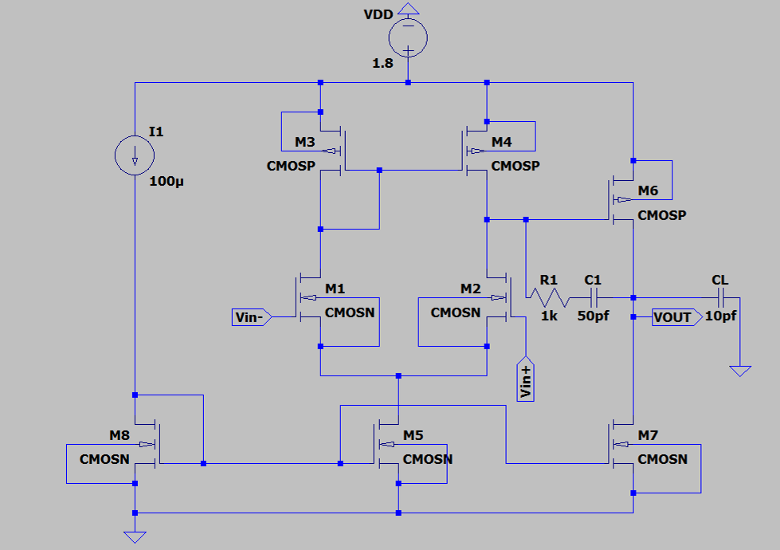
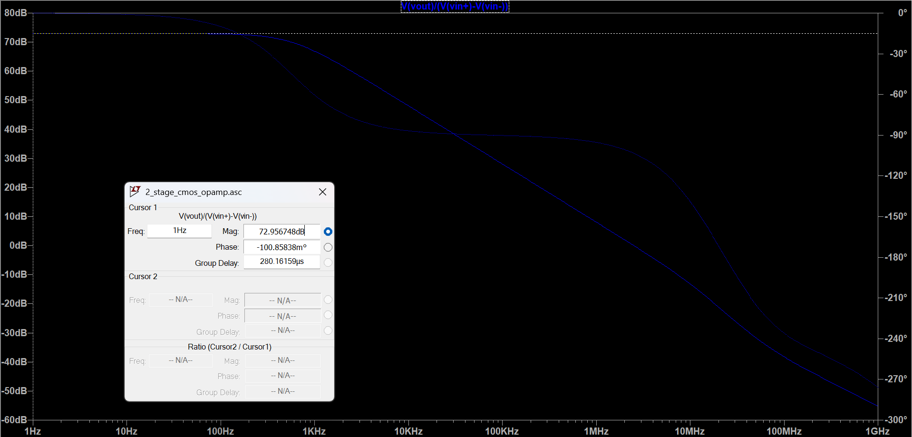
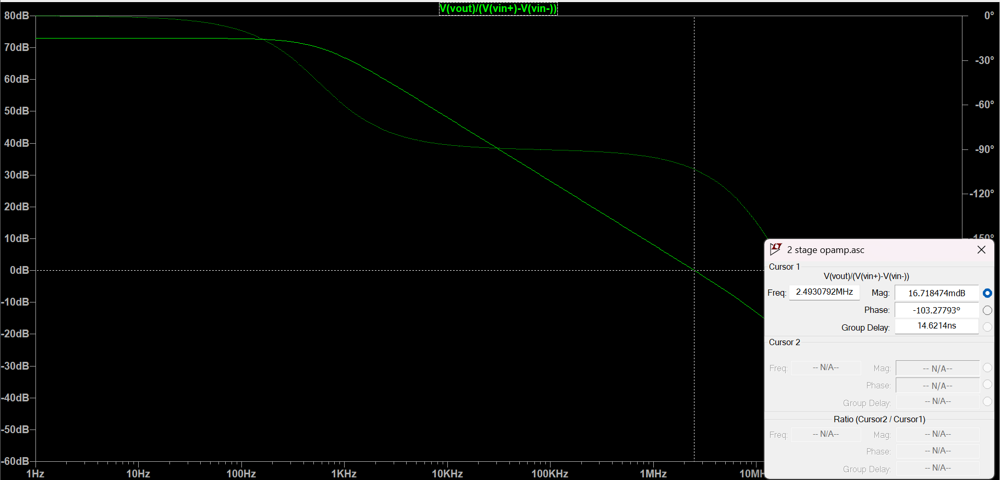
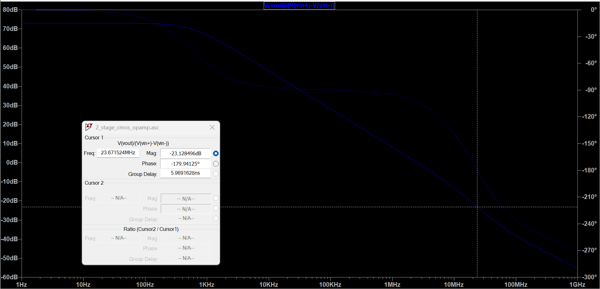

# 2-Stage CMOS Operational Amplifier

## Overview

This project implements and simulates a two-stage CMOS operational amplifier
using LTspice and a 180 nm CMOS technology model.

The design focuses on achieving high DC gain, good gain-bandwidth product,
and stable frequency response using Miller compensation with a nulling resistor.

## Schematic



## Specifications

| Parameter | Result |
|---|---:|
| Supply Voltage | 1.8 V |
| DC Gain | ~73 dB |
| GBW | ~2.49 MHz |
| Phase Margin | ~76.7° |
| Gain Margin | ~23.2 dB |
| Load Capacitance | 10 pF |
| Compensation Capacitor | 50 pF |
| Nulling Resistor | 1 kΩ |

## Circuit Architecture

The op-amp consists of:

- Differential input stage
- Current-mirror active load
- Second gain stage
- Miller frequency compensation
- Nulling resistor
- Capacitive load

## Compensation

Miller compensation is implemented using a 50 pF compensation capacitor
in series with a 1 kΩ nulling resistor.

The nulling resistor modifies the compensation zero and helps improve
the frequency stability of the amplifier.

## DC Operating Point

The circuit was verified using LTspice DC operating-point analysis.

| Parameter | Value |
|---|---:|
| Supply Voltage | 1.8 V |
| Input Common-Mode Voltage | 1 V |
| Output DC Voltage | 0.907 V |
| Tail Current | 100 µA |
| M1/M2 Drain Current | ~49.1 µA |
| M3/M4 Drain Current | ~49.1 µA |
| M5 Drain Current | ~98.2 µA |
| M6/M7 Drain Current | ~91.3 µA |
| M8 Drain Current | 100 µA |

Full operating-point data is available in
`results/operating_point.txt`.

## AC Analysis

The open-loop frequency response was analyzed to determine:

- DC gain
- Gain-bandwidth product
- Unity-gain frequency
- Phase margin
- Gain margin

### DC Gain



The simulated low-frequency open-loop gain is approximately **73 dB**.

### GBW and Phase Margin



The unity-gain frequency is approximately **2.49 MHz**, with a phase margin
of approximately **76.7°**.

### Gain Margin



The simulated gain margin is approximately **23.2 dB**.

## Simulation

The circuit was simulated in LTspice using the TSMC 180 nm CMOS technology
model.

Simulation analyses performed:

- DC operating-point analysis
- AC frequency-response analysis
- Open-loop gain measurement
- Gain-bandwidth measurement
- Phase-margin measurement
- Gain-margin measurement

## Tools & Technology

- **Simulation Tool:** LTspice
- **Technology:** TSMC 180 nm CMOS
- **Supply Voltage:** 1.8 V

## Repository Structure

```text
2-stage-cmos-opamp/
│
├── README.md
│
├── schematic/
│   ├── 2_stage_cmos_opamp.asc
│   └── schematic.png
│
├── models/
│   └── tsmc018.lib
│
└── results/
    ├── dc_gain.png
    ├── gbw_phase_margin.png
    ├── gain_margin.png
    └── operating_point.txt
